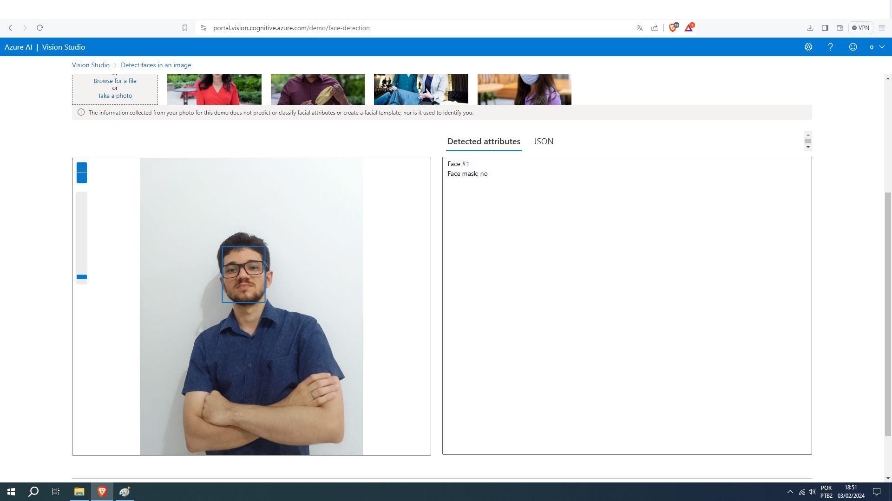
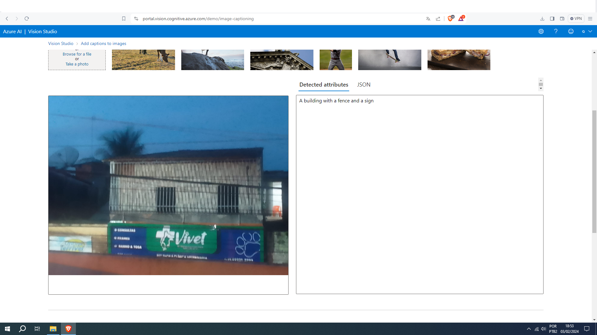
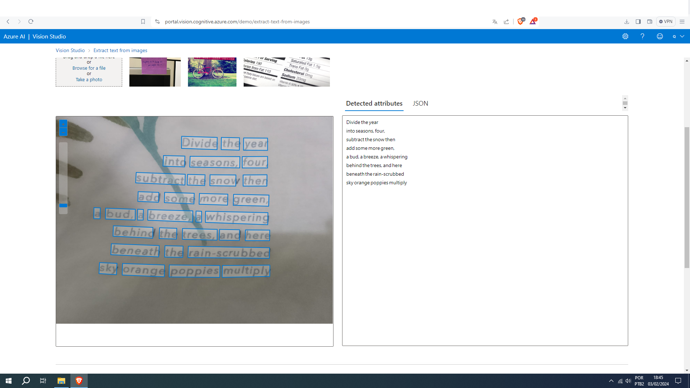

# Azure AI vision

Tirei algumas fotos e utilizei para:

## Reconhecimento facial

## Captura de imagem

## Reconhecimento de texto

# Azure Vision 

O Azure Computer Vision é um serviço da Microsoft Azure que oferece recursos avançados de visão por computador para análise de imagens. Este serviço executa diversas análises na imagem, utilizando algoritmos avançados de visão computacional e aprendizado de máquina.

## Funcionalidades Principais

### Detecção de Objetos

Identificação e localização de objetos na imagem.

### Identificação de Texto

Reconhecimento e extração de texto presente na imagem.

### Classificação de Conteúdo

Avaliação do conteúdo da imagem, identificando categorias e tags relevantes.

### Detecção de Faces

Identificação e análise de características faciais.

### Análise de Cores e Estatísticas

Extração de informações sobre as cores predominantes na imagem.

## Retorno de Resultados

O serviço retorna os resultados da análise em um formato estruturado, como JSON, que contém informações detalhadas sobre os elementos identificados na imagem.

## Aplicações e Tomada de Decisões

Com base nos resultados, os desenvolvedores podem integrar essas informações em suas aplicações para tomar decisões ou fornecer insights adicionais aos usuários.

## Segurança e Conformidade

O Azure Computer Vision segue práticas de segurança e conformidade, garantindo a proteção dos dados e a conformidade com regulamentações específicas do setor.

## Lição

Eu aprendi que a inteligencia artifial está se tornando cada vez mais importante nas nossas vidas e que futuramente muitas profissões surgirão por causa dela

