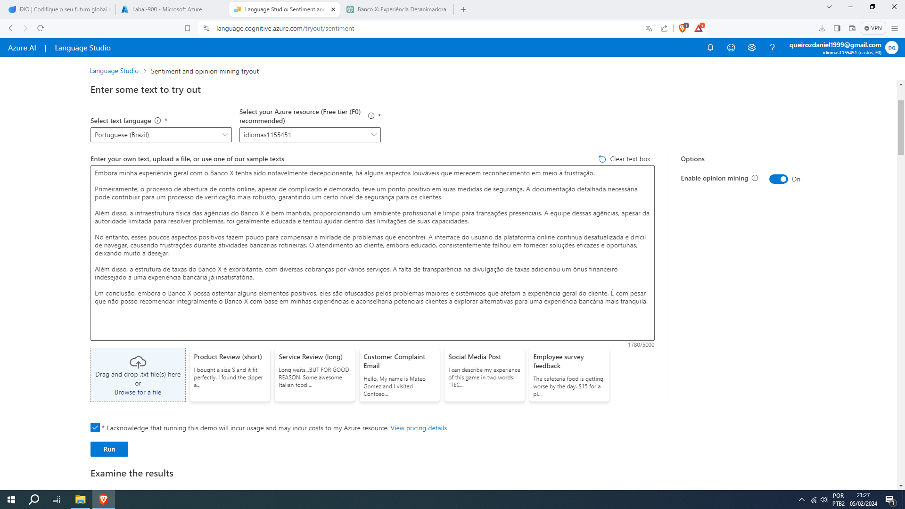
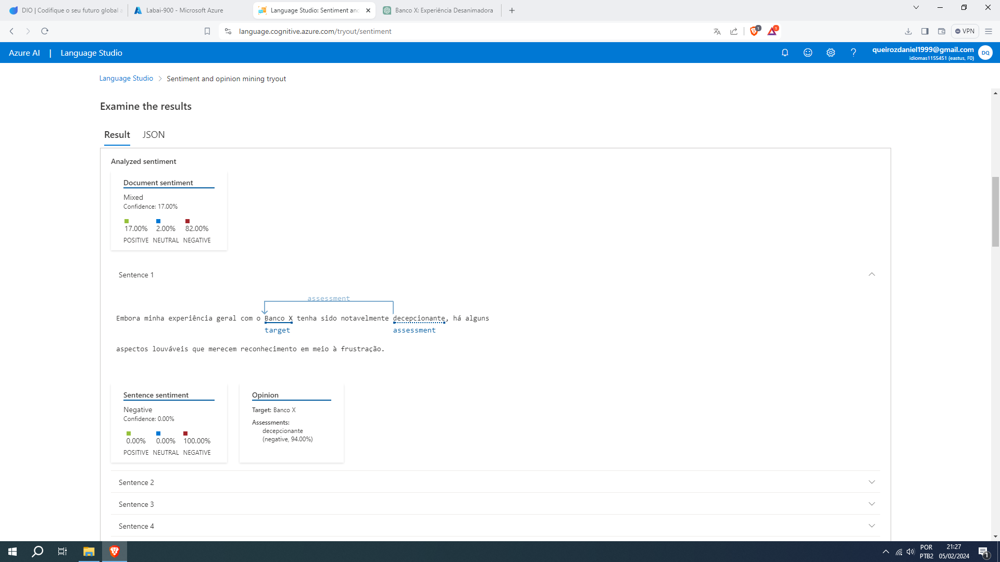
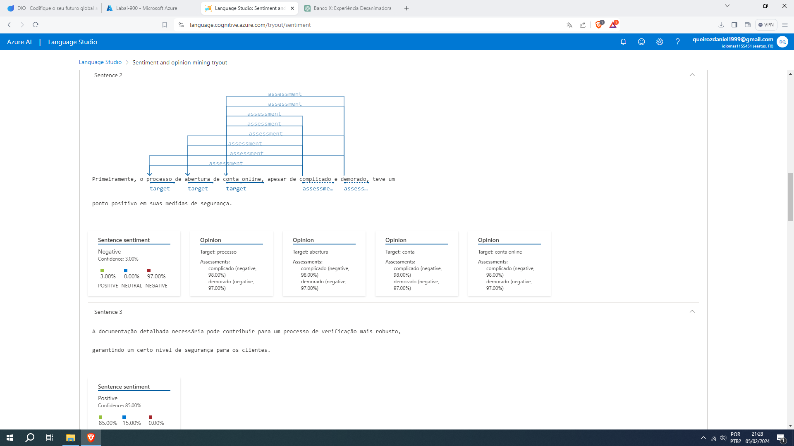
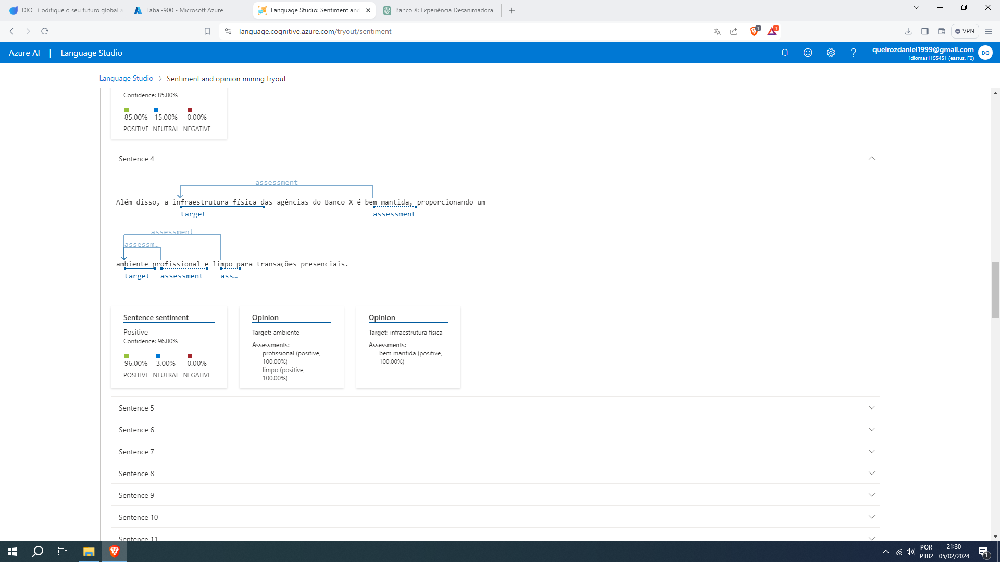

## Language Studio no Azure 

Neste projeto, explorei o Azure Language Studio para análise de sentimentos em um contexto fictício, utilizando um exemplo relacionado a um banco. 

Esse foi o resultado da primeira sentença, a IA pegou a palavra "decepcionante" e logo associou ao banco, assim aumentando o sentimento negativo.
Na análise geral a IA entendeu que o texto é mais negativo que positivo.

Nessa sentença a IA achou vários alvos e associou ao pessimismo e só não deixou em 100% por causa do ponto positivo da medida de segurança.

Já nessa sentença a IA entendeu que o sentimento era totalmente positivo por causa das boas palavras relacionada a infraestrutura e o ambiente.

### Lição

Esse tecnologia é muito útil ,por exemplo, para ler comentários de um aplicativo. Já que existe milhares de comentários é melhor deixar a IA trabalhar e dar um diagnóstico do sentimento e do que a maioria dos comentários estão falando, se o sentimento for pessimista os desenvolvedores vão ter que descobrir o que está errado e aprimorar o aplicativo.
