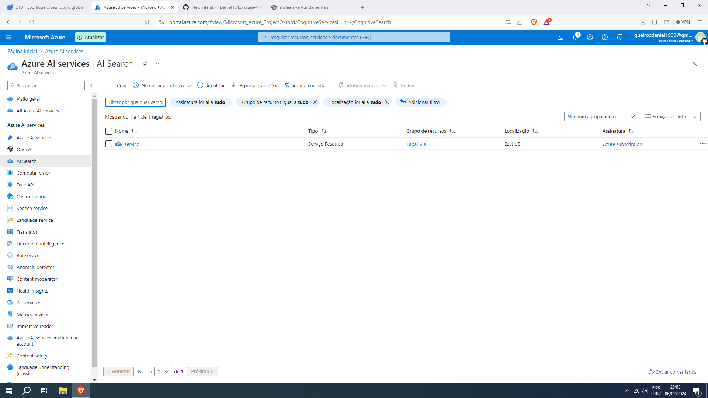
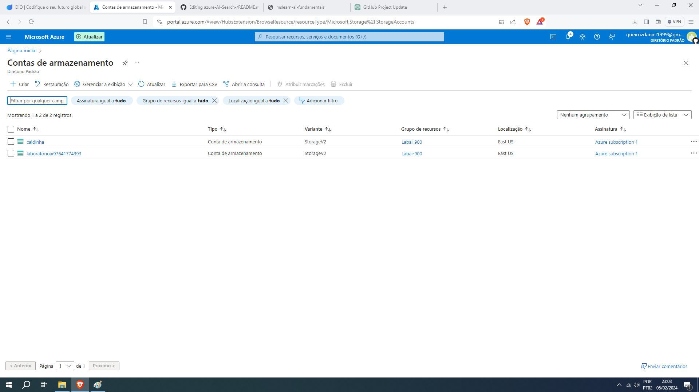
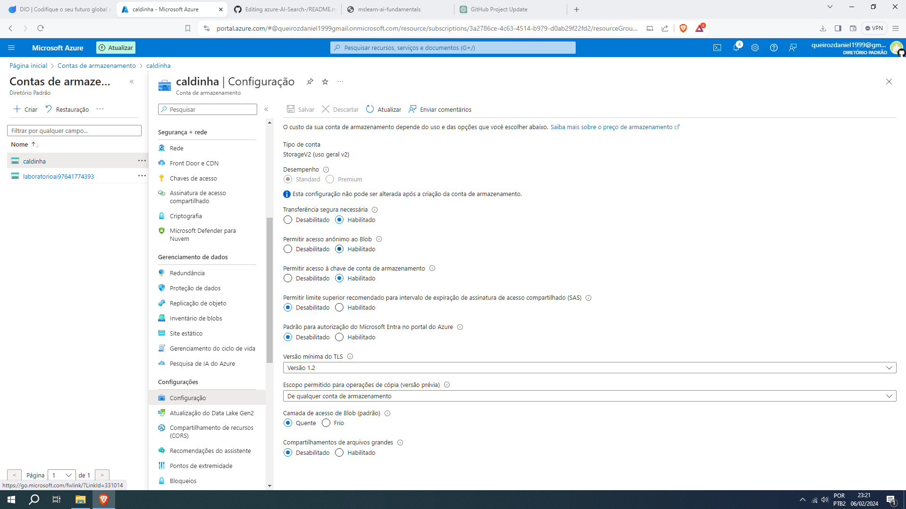
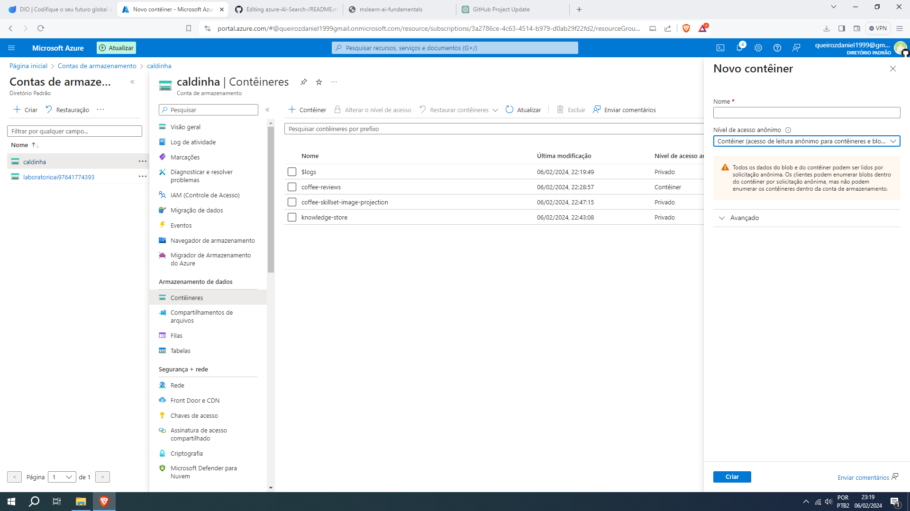
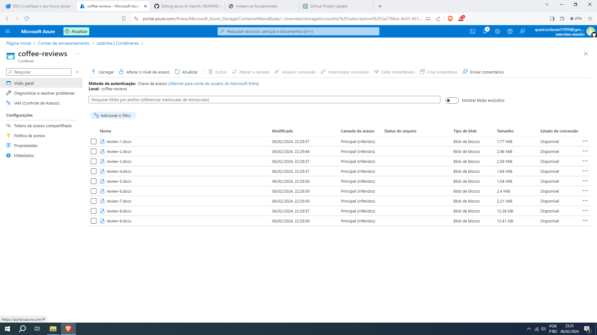
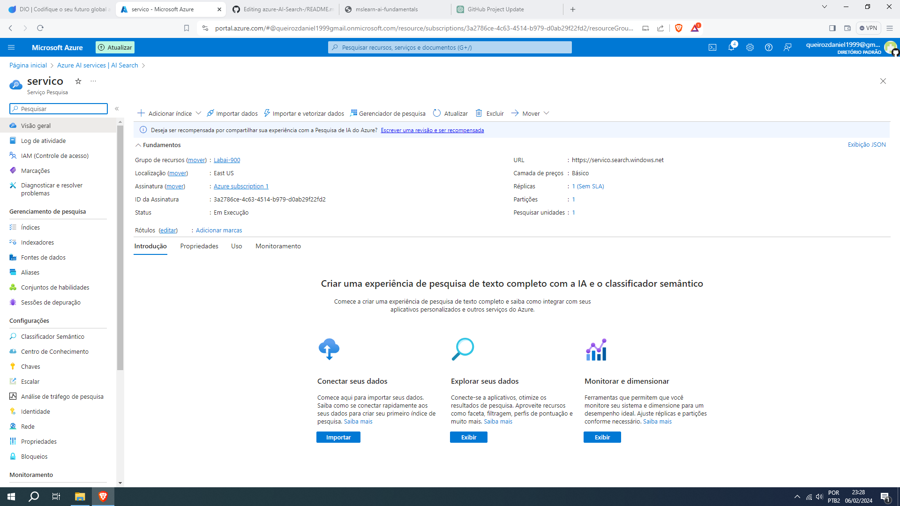
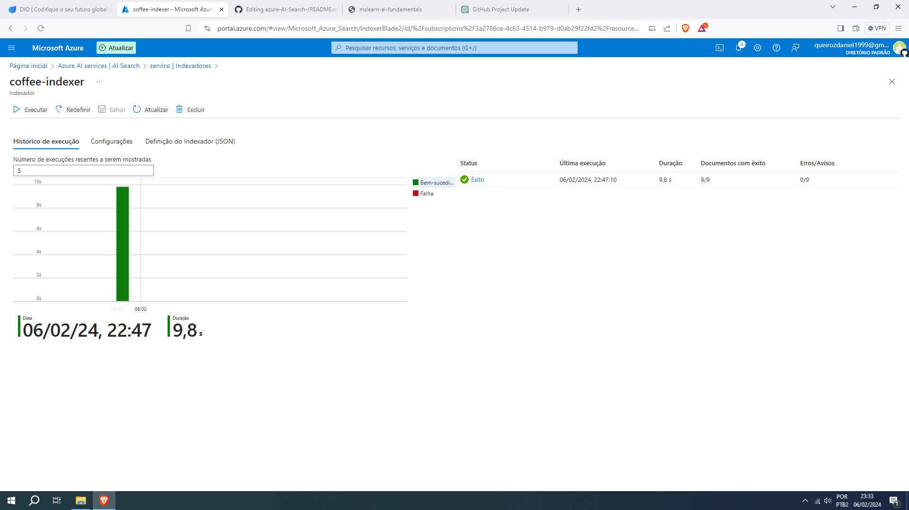
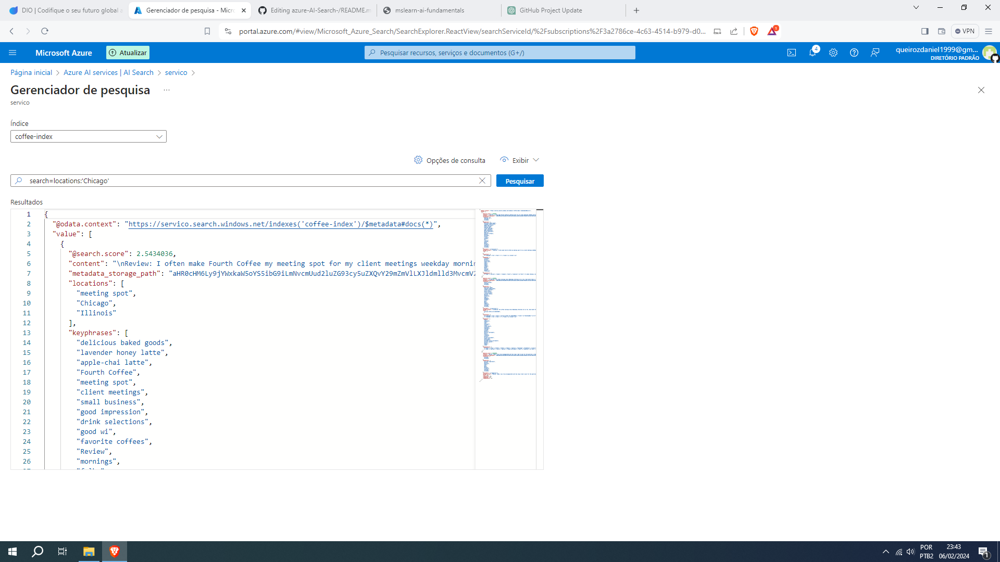

# Azure AI Search

## Recursos do Azure necessários

Para configurar uma pesquisa no Azure, primeiro adicione o Azure AI Search e crie um recurso.

### Configurações do Azure AI Search

1. **Assinatura:** Sua assinatura do Azure.
2. **Grupo de recursos:** Selecione ou crie um grupo de recursos com um nome exclusivo.
3. **Nome do serviço:** Um nome único.
4. **Localização:** Escolha qualquer região disponível.
5. **Nível de preços:** Básico

### Configurações do Recurso

1. **Assinatura:** Sua assinatura do Azure.
2. **Grupo de recursos:** O mesmo grupo de recursos que o recurso de Pesquisa de IA do Azure.
3. **Região:** O mesmo local do recurso de Pesquisa de IA do Azure.
4. **Nome:** Um nome único.
5. **Nível de preços:** Padrão S0
6. Marque a caixa de seleção para confirmar os termos.

### Conta de Armazenamento

1. **Assinatura:** Sua assinatura do Azure.
2. **Grupo de recursos:** O mesmo grupo de recursos que os recursos de serviços Azure AI Search e Azure AI.
3. **Nome da conta de armazenamento:** Um nome único.
4. **Localização:** Escolha qualquer local disponível.
5. **Desempenho:** Padrão
6. **Redundância:** Armazenamento localmente redundante (LRS)

### Configuração da Conta de Armazenamento

1. **Permita acesso anônimo ao Blob:** Ativado.

## Carregar Documentos para o Armazenamento do Azure

1. Selecione **Contêineres** no menu à esquerda.
2. Selecione **+ Contêiner** e crie um contêiner com as configurações:

   - **Nome:** avaliacoes-de-cafe
   - **Nível de acesso público:** Container (leitura anônima para containeres e blocos)
   - **Avançado:** sem alterações.

3. Baixe os comentários sobre café zipados de [https://aka.ms/mslearn-coffee-reviews](https://aka.ms/mslearn-coffee-reviews) e extraia para a pasta "comentarios".

No portal do Azure, selecione o avaliações de café. No contêiner, selecione upload e escolha os arquivos baixados.

4. No portal do Azure, vá para o recurso Azure AI Search. Na página **Visão geral**, selecione "Importar dados".

5. Conecte-se aos dados do armazenamento de blobs do Azure com as configurações adequadas.
1. Fonte de Dados: Armazenamento de Blobs do Azure
2. **Nome da Fonte de Dados:** dados do cliente-café
3. **Dados para Extrair:** Conteúdo e metadados
4. **Modo de Análise:** Padrão
5. **Cadeia de Conexão:** *Selecionar Escolha uma conexão existente. Selecione sua conta de armazenamento, escolha o contêiner avaliações de café e clique em Selecionar.*
6. **Autenticação de Identidade Gerenciada:** Nenhum
7. **Nome do Recipiente:** *Esta configuração é preenchida automaticamente após escolher uma conexão existente.*
8. **Pasta Blob:** Deixe em branco
9. **Descrição:** Avaliações para Fourth Coffee shops
10. **Selecionar Próximo: Adicionar Habilidades Cognitivas (Opcional).**

## Adicionar Habilidades Cognitivas

No Anexar Serviços Cognitivos seção, selecione seu recurso de serviços de IA do Azure.

1. **Nome do Skillset:** café-skillset
2. **Ativar OCR e Mesclar Todo o Texto no Campo Merged_content**
3. **Campo de Dados de Origem:** mesclado_content
4. **Nível de Granularidade de Enriquecimento:** Páginas (5000 pedaços de caracteres)
5. **Permitir Enriquecimento Incremental**
6. **Campos Enriquecidos:**
   - **Extrair Nomes de Localização:** locais
   - **Extrair Frases-chave:** frases-chave
   - **Detectar Sentimento:** sentimento
   - **Gerar Tags a partir de Imagens:** imageTags
   - **Gerar Legendas a partir de Imagens:** imageCaption
## Salvar enriquecimentos em uma loja de conhecimento
1. Selecione:
   - Projeções de imagem
   - Documentos
   - Páginas
   - Frases-chave
   - Entidades
   - Detalhes da imagem
   - Referências de imagem

2. Se um aviso pedindo uma String de Conexão de Conta de Armazenamento aparecer, selecione "Escolha uma conexão existente".
3. Escolha a conta de armazenamento criada anteriormente.
4. Clique em "+ Recipiente" para criar um novo contêiner chamado "loja de conhecimento" com o nível de privacidade definido para Privado e clique em Criar.
5. Selecione o contêiner "loja de conhecimento" e clique em Selecionar na parte inferior da tela.
6. Selecione "Projeções de blob do Azure: Documento". A configuração para Nome do recipiente com o "loja de conhecimento" é preenchida automaticamente pelo contêiner. Não altere o nome do recipiente.
7. Selecione "Próximo: Personalizar índice de destino".
8. Mude o Nome do índice para "índice de café".
9. Certifique-se de que a Chave está definida para metadata_armazenamento_caminho. Deixe o Nome do sugador em branco e o Modo de pesquisa autopovoado.
10. Revise as configurações padrão dos campos do índice. Selecione "filtrável" para todos os campos que já estão selecionados por padrão.
11. Selecione "Próximo: Criar um indexador".
12. Mude o Nome do indexador para "índice de café".
13. Deixe o Agendar definido para Uma vez.
14. Expanda as Opções avançadas. Certifique-se de que a opção Chaves de Codificação Base-64 está selecionada, pois as chaves de codificação podem tornar o índice mais eficiente.
15. Selecione "Enviar" para criar a fonte de dados, conjunto de habilidades, índice e indexador. O indexador é executado automaticamente e executa o pipeline de indexação, que:
   - Extrai os campos de metadados do documento e o conteúdo da fonte de dados.
   - Executa o conjunto de habilidades cognitivas para gerar campos mais enriquecidos.
   - Mapeia os campos extraídos para o índice.
Na metade inferior do Visão geral página para o seu recurso Azure AI Search, selecione o Indexadores guia. Esta guia mostra o recém-criado índice de café. Espere um minuto e selecione ↻ Atualizar até o Status indica sucesso.

Selecione o nome do indexador para ver mais detalhes.

## Consultar o Índice Geral

1. No serviço de pesquisa, acesse a Visão geral da página.
2. Selecione o "Gerenciador de Pesquisa" na parte superior da tela.
3. No campo "Cadeia de Consulta", insira `search=*&$count=true`.
4. Clique em "Pesquisar".

A consulta de pesquisa retornará todos os documentos no índice de pesquisa, apresentando uma contagem total de documentos no campo `@odata.count` em um documento JSON.

## Filtrar por Localização (Exemplo: Chicago)

1. No campo "Cadeia de Consulta", insira `search=locations:'Chicago'`.
2. Clique em "Pesquisar".

Esta consulta filtra os documentos no índice, exibindo apenas as avaliações que têm a localização em Chicago.

## Filtrar por Sentimento (Exemplo: Negativo)

1. No campo "Cadeia de Consulta", insira `search=sentiment:'negative'`.
2. Clique em "Pesquisar".

Essa consulta filtra os documentos no índice, exibindo apenas as revisões que possuem um sentimento negativo.

Certifique-se de ajustar os termos de busca de acordo com suas necessidades específicas, utilizando este guia como referência para otimizar suas consultas no índice de pesquisa.

## Visualizar a Loja de Conhecimento

1. No painel do menu à esquerda, selecione "Recipientes".
2. Escolha o recipiente da "Loja de Conhecimento".

3. Selecione qualquer item disponível e clique no arquivo "objectprojection.com".

4. Escolha "Editar" para visualizar o JSON gerado para um dos documentos no armazenamento de dados do Azure.

## Explorar Imagens no Recipiente Café-Skillset-Imagem-Projeção

1. No painel "Recipientes", selecione o recipiente "café-skillset-imagem-projeção".
2. Escolha qualquer item disponível.

3. Selecione qualquer arquivo .jpg disponível.
4. Clique em "Editar" para visualizar a imagem armazenada no documento. Observe como todas as imagens dos documentos são armazenadas dessa maneira.

## Navegar pelas Tabelas no Armazenamento

1. No painel esquerdo, selecione "Navegador de Armazenamento".
2. Escolha "Tabelas".

3. Examine as tabelas disponíveis. Cada entidade no índice possui uma tabela correspondente.
4. Selecione a tabela "coffeeSkillsetKeyPhrases".

## Analisar Frases-chave

1. Analise as frases-chave que a loja de conhecimento conseguiu capturar do conteúdo nas avaliações.
2. Observe que muitos dos campos são chaves, permitindo a vinculação das tabelas como um banco de dados relacional.
3. O último campo mostra as frases-chave extraídas pelo conjunto de habilidades.

## Lição

A ferramenta de pesquisa é muito útil para empresas que possuem milhares de documentos e não tem tempo nem pessoas para analisar todos eles, por isso pode utilizar essa ferramenta para análise de sentimentos e para achar palavras chaves por exemplo, e em conjunto com outras ferramentas é possível traduzir textos e até resumir textos grandes em questão de segundos.

