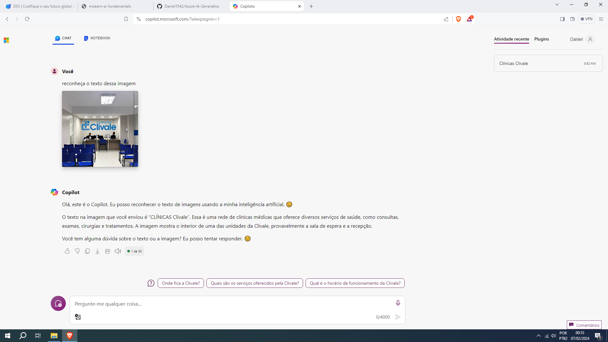
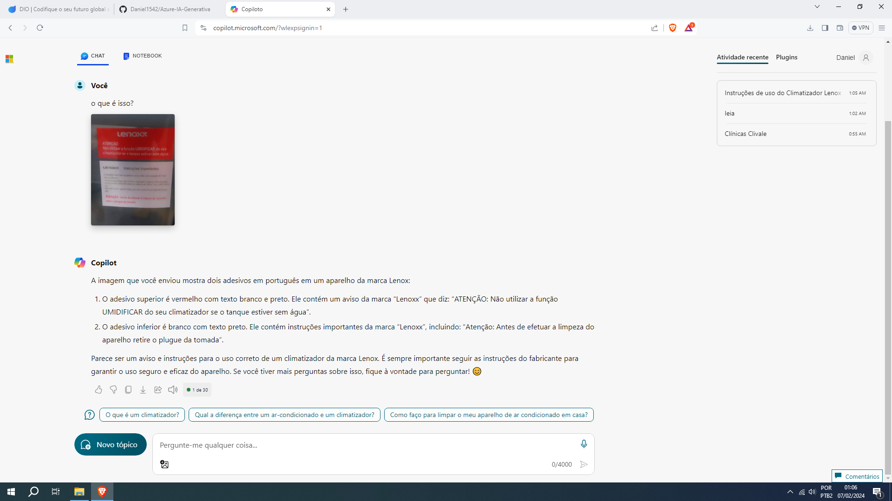
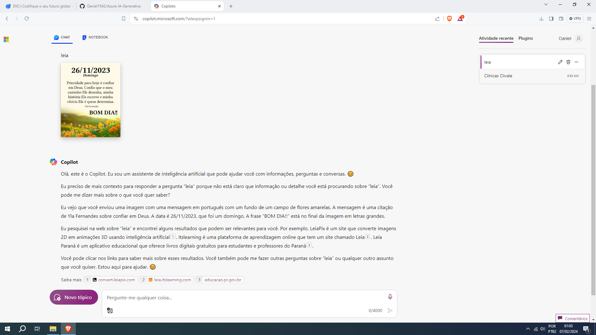
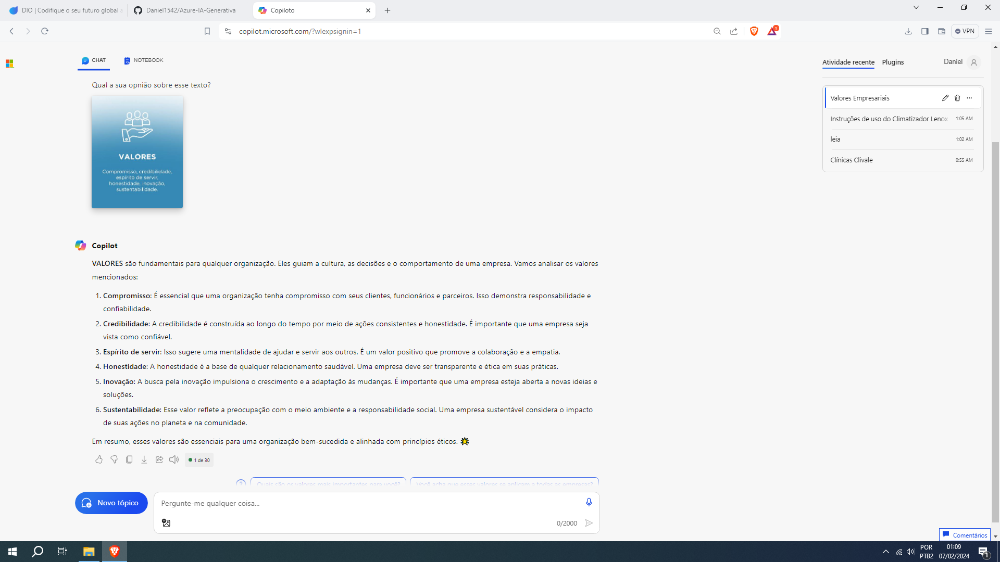

# IA generativa

## Clínica

Comecei colocando pra reconhecer o texto nessa imagem.

A IA reconheceu e ainda deu informações extras sobre o lugar e a clínica

## Adesivos

Tirei uma foto aleatória e pedir pra IA responder.

A IA respondeu com precisão o idioma, conteúdo e marca do produto dos adesivos. 

## Mensagem

Escrevi "leia" pro chat.

O texto da imagem foi traduzido, mas a IA se confundiu com "leia".

## Texto

Por último pedi pra IA a opnião dela sobre esse texto.

Ela escreveu um pouco sobre cada palavra.

## Lição

Essa ferramenta é muito útil para o público em geral. Para programadores é boa, pois auxilia na hora de fazer códigos e de corrigi-los.
Para pessoas que querem criar logotipos para sua empresa também vai ser útil. Para quem quer um auxílio no TCC, a IA pode indicar artigos, fazer a introdução e até da temas para a área escolhida.

